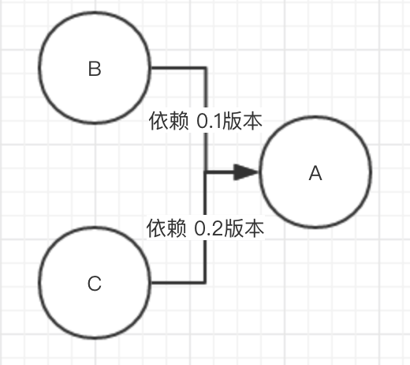

### Version 1.0.1.1

- 支持检查不生效的`@Proxy`和`@Insert`。

#### 背景

举个例子，以下用法：

```Java
@Proxy("onResume")
@TargetClass("com.ss.android.newmedia.ad.AdManager")
```

假如这里的`@TargetClass`所配置的类名写错了，或者`@Proxy`所配置的方法不存在，原来lancet gradle插件并不会有任何提醒。为此，需要增加`@Proxy`和`@Insert`是否生效的检查。

#### 实现

实现非常简单。lancet会将代码中所有的`@Proxy`和`@Insert`的注解信息都提取出来，然后全局扫描每一个class文件，当`@Proxy`或`@Insert`起作用时，给对应生效的`@Proxy`或`@Insert`加个tag。到扫描完所有class后，再遍历所有的`@Proxy`和`@Insert`的注解信息，如果存在没有加tag的注解，证明该注解没有生效，则报警。

#### 用法

这个检查功能有个开关，默认是开的。

```gradle
lancet {
    checkUselessProxyMethodEnable true
}
```

如果我们使用`@Insert(value = "onResume")`，但目标类没有`onResume`方法，需要添加`@Insert(value = "onResume, shouldIgnoreCheck = true")`来跳过检查。

#### 耗时

原先耗时6740毫秒，改造后耗时9260毫秒。

### Version 1.0.5.1

- 支持检查代码中调用不存在的方法

#### 背景

粗略一看，如果调用了不存在的类方法，那编译器不会报错吗？编译器只会负责把主工程的java代码编译成class时做语法检查，但它所依赖的jar或aar里的class文件编译器并不会检查。下面我们来看看这种情况。

主工程依赖了B库和C库，调用了B库的b方法。B库依赖A库的1.0版本，B库里的b方法里调用了A库的a方法；C库依赖A库的2.0版本，A库的2.0版本去掉了a方法。



Gradle在处理相同依赖时默认使用较高的版本，即A库的2.0版本。问题是，B库的b方法调用了A库的a方法，但这个版本的A库并没有a方法，因此运行时就会crash。

#### 实现

两次全局扫描所有class文件。

- 第一次全局扫所有class文件。扫描每个class文件都可以获得这些重要信息：类名，父类名，实现的接口名，有这些我们就可以构建一个工程里所有类的依赖图（家族树）；还有这个类的方法名，方法签名，类字段名。
- 第一步所得到的类的依赖图不是完整的，还缺少Android SDK和JDK里的类，这些类都在android.jar里。我事先用脚本扫描了一遍android.jar，把扫描所得的类的信息序列化为一个json文件（lancet_extra/android_sdk.json）。加上这些类的信息，那所构造的类的依赖图就是完整的，即每个类都能向上追溯到根为`java/lang/Object.java`。
- 第二次全局扫描所有class文件。用ASM扫描所有类的方法和方法调用指令，把所扫描的类方法的类名，方法名和方法签名作为key，value为true，放入一个map里；把所有被调用的方法所在的类名，方法名和方法签名作为key，Value为false，如果这个方法还没被添加到map里了则放入map里；对于所有接口方法和抽象类方法，将所有的实现类的类名，方法名和方法签名分别作为key，Value为true，添加到map里。
- 最后一部就是检查这个map。先把Value为true的元素过滤掉，逐个检查Value为false的方法，回溯检查它的父类是否存在这个方法，如果到了根类也不存在这个方法，证明这个方法不存在。

#### 用法

```gradle
lancet {
    strictMode true // true直接抛异常中断构建，false在build/lancet目录下输出error log
    checkMethodNotFoundEnable true // 检查无用方法检查的开关
    useFileLog "output" // 配置输出log文件名
}
```

在主工程中创建目录lancet_extra，在目录内存放android_sdk.json和white_list.json。android_sdk.json内容是sdk中的所有类的信息，用于插件工作时能构建一个完整的类的家族树。 white_list.json配置一个json数组，数组元素是需要检查过滤的类的正则表达式。

#### 耗时

改造后耗时15174毫秒。

#### TODO

- 支持检查引用不存在的类变量
- 优化扫描效率

### Version 1.0.6.5

- SPI优化。打包前读取配置文件，通过字节码注入，将接口和实现类之间的映射事先建立好，避免运行期读配置文件。
- 检查接口文件和配置的实现类是否存在，检查相应的接口文件和实现类是否已经配进了混淆排除配置文件。

#### 背景

项目里SPI框架的实现是这样的。通过接口动态获取相应的实现类。SPI框架在运行时读取接口配置文件，获取到实现类的类名，然后通过得到的类名反射实例化相应的实现类。

```Java
    private static List<CacheItem> parse(URL url) {
        List<CacheItem> classNames = new LinkedList<>();
        InputStream is = null;
        InputStreamReader isr = null;
        BufferedReader br = null;
        try {
            is = url.openStream();
            isr = new InputStreamReader(is);
            br = new BufferedReader(isr);
            String line = br.readLine();
            while (line != null) {
                CacheItem cacheItem = CacheItem.fromConfig(line);
                if (cacheItem != null) {
                    classNames.add(cacheItem);
                }
                line = br.readLine();
            }
        } catch (IOException e) {
            e.printStackTrace();
        } finally {
            closeQuietly(br);
            closeQuietly(isr);
            closeQuietly(is);
        }
        return classNames;
    }
```

由于读文件操作耗时较长，所以放到打包前，读取所有接口配置文件，得到接口和实现类的映射关系，通过字节码的形式来注入。


#### 实现

两次全局扫描。

- 第一次全局扫描，收集所有接口配置文件的信息。配置文件名就是接口名，文件内容配置了相应的实现类的类名。
- 第二次全局扫描。找到要注入的类（com.ss.android.ugc.aweme.framework.services.ConfigLoader），在这个类的静态初始化方法`<clinit>`注入字节码。

```Java
class ConfigLoader {

    private static final String[] DIRS = {"services/", "services/AwemeLive/", "services/AwemeIM/",
            "services/AwemeReactNative/", "services/AwemePush/", "services/AwemeShare/",
            "services/AwemeMain/", "services/AwemePlugin/", "services/SdkDebugger/",
            "services/AwemeMusic/", "services/AwemeVideo/", "services/AwemeFramework/",
            "services/AwemeCommerce/"};

    private static final Map<String, List<CacheItem>> CLASSES
            = Collections.synchronizedMap(new LinkedHashMap<String, List<CacheItem>>());

    // Only for ASM
    private static void addCache(String interfaceName, String fileContent) {
        String[] implementClasses = fileContent.split("\n");
        ArrayList<CacheItem> implementsList = new ArrayList<>();
        for (String implementClass : implementClasses) {
            implementsList.add(CacheItem.fromConfig(implementClass));
        }
        CLASSES.put(interfaceName, implementsList);
    }
    ...
}
```

- 在第二次全局扫描时，对相应的接口和实现类做下标记。扫描结束时，检查所有的接口和实现类，当发现有没被标记的接口或实现类，则报错。
- 读取项目中的混淆配置文件，检查是否有SPI接口没有配keep。我们统一将SPI接口的所有实现类一起keep。举个栗子：

```
-keep class * implements com.ss.android.ugc.aweme.framework.services.IShareService{ *; }
```

#### 用法

```Gradle
    lancet {
        spi {
            spiServicePath "aweme/src/main/resources"
            injectClassName "com/ss/android/ugc/aweme/framework/services/ConfigLoader"
            proguardFilePath "aweme/proguard-rules.pro"
        }
    }
```

- `spiServicePath` 配置的是主工程里的接口配置文件的路径。之所以需要额外配置，是因为这种资源的合并被放在gradle plugin transform之后。其它aar的接口配置文件就不需要额外配置了。
- `injectClassName` 配置字节码注入的类名。如果这个类不存在插件会报错的哦~
- `proguardFilePath` 配置混淆配置文件的路径

#### 耗时

改造后耗时11237毫秒。

### Version 1.0.6.6

- spi接口和实现类混淆报警优化
- 支持配置多个SPI Service目录路径

#### 用法

spiServiceDirs代替原来的spiServicePath，支持配置多个目录路径。

```
lancet {
    spi {
        spiServiceDirs "aweme/src/main/resources", "xxx"
    }
}
```
### Version TODO

- 允许在工程中配置脚本（计划用Java），hook gradle插件的扫描操作。类似于webhook的功能（不好解释，你懂的~）。
- 支持在AOP方法内访问类的私有变量或私有方法（调研一下）